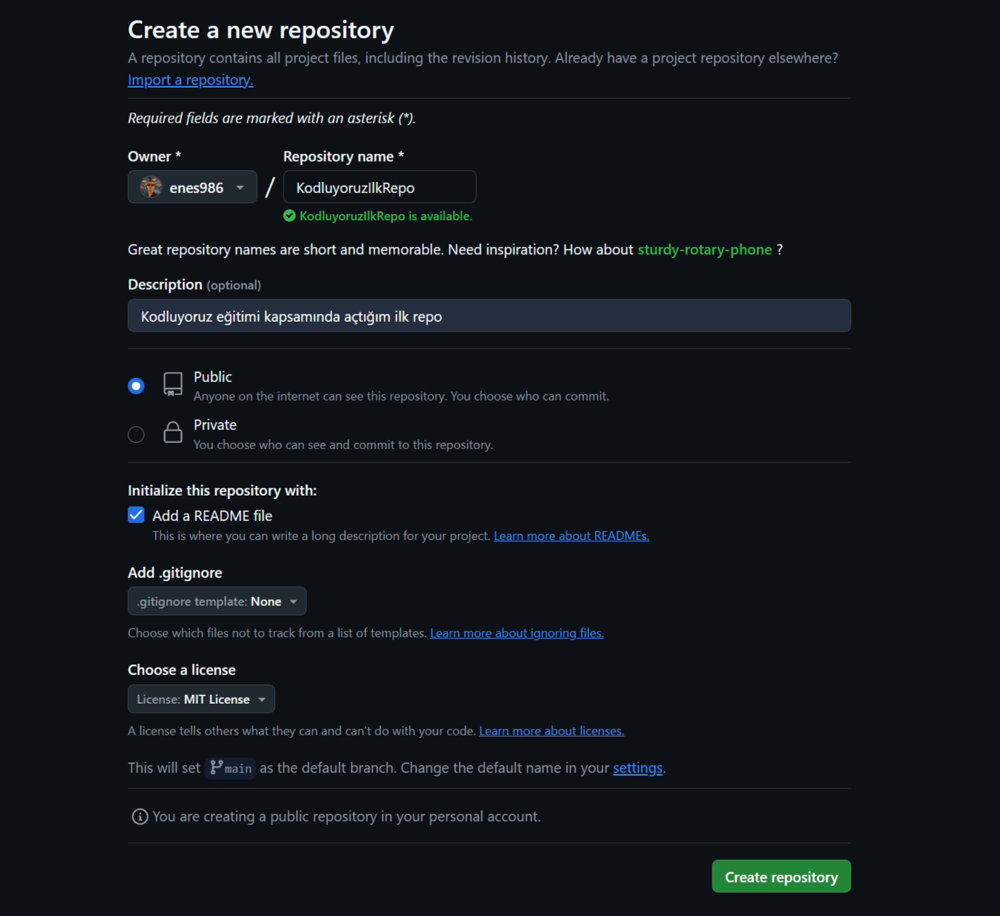

# Kodluyoruz Ilk Repo
***
Bu repo [Kodluyoruz](https://kodluyoruz.org) Front-End Eğitiminde oluşturduğumuz ilk repo. İçerisinde bir adet README dosyası, bir adet de index.html bulunuyor.



## Intallation 
***
Öncelikle projeyi clonelayın.(Buraya sizin reponuzdan aldığınız link gelecek)
```bash
git clone https://github.com/enes986/KodluyoruzIlkRepo.git
```

## Usage
***
Projeyi cloneladıkdan sonra Visual Studio Code programında açınız

Linux için:
```linux
cd KodluyoruzIlkRepo 
code .
```


## Contributing 
***
Pull requestler kabul edilir. Buyuk değişiklikler için, lütfen önce neyi değiştirmek istediğinizi tartışmak için bir konu açınız.


## License
***
[MIT](https://choosealicense.com/licenses/mit/)